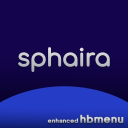

<div align="center">



# sphaira - enhanced hbmenu

</div>

**sphaira** ist eine Alternative zu hbmenu. Es bietet aktuell die gleichen Funktionen wie hbmenu `das heißt, es startet Homebrew + nxlink` und fügt einige weitere Funktionen hinzu.


### HomeBrew​
Der Hauptmenü-Tab listet alle .nro-Dateien auf, die in `/switch/` gefunden wurden. Von dort aus kannst du sie `starten, sortieren, löschen, einen Forwarder erstellen` usw.
Du kannst mit den Tasten **`L`** und **`R`** zu den anderen Menü-Tabs navigieren, die unten erklärt werden.

### DateiBrowser​
Durch Drücken von **`L`** im Hauptmenü kannst du auf den Dateibrowser zugreifen. Du kannst Dateien `Ausschneiden, Kopieren, Löschen, Umbenennen` usw.
Du kannst mehrere Dateien/Ordner auswählen, indem du die **`ZR`**-Taste verwendest und dann die oben genannten Funktionen auf diese Gruppe von Dateien anwendest.

Forwarder können erstellt werden, wenn die ausgewählte Datei eine Dateizuordnung hat, siehe unten für weitere Details.

### hb-appstore​
sphaira enthält einen App-Store, der die API von [hb-appstore​](https://hb-app.store/switch) verwendet. Du kannst durch Drücken von **`R`** im Hauptmenü darauf zugreifen.
Der App-Store bietet die gleichen Funktionen wie die hb-appstore-App und installiert die Manifeste im selben Ordner wie hb-appstore​, um die Kompatibilität zwischen beiden nicht zu beeinträchtigen.

### Themes​
sphaira kommt mit 3 Themes: Abyss (Standard), Black und White (unvollendet).
Benutzerdefinierte Themes können zu `/config/sphaira/themes/` hinzugefügt werden. Hier ist zum Beispiel das `Abyss_theme`:

```ini
[meta]
name=Abyss
author=TotalJustice
version=1.0.0
preview=romfs:/theme/preview.jpg

[theme]
background=0x0f111aff
grid=0x0f115c30
selected=0x0f115cff
selected_overlay=0x529cffff
text=0xffbc41ff
text_selected=0x529cffff

icon_audio=romfs:/theme/icon_audio.png
icon_video=romfs:/theme/icon_video.png
icon_image=romfs:/theme/icon_image.png
icon_file=romfs:/theme/icon_file.png
icon_folder=romfs:/theme/icon_folder.png
icon_zip=romfs:/theme/icon_zip.png
icon_nro=romfs:/theme/icon_nro.png
```

Musik kann zu einem Theme hinzugefügt werden, solange die Musik in das bfstm-Format konvertiert wurde. Füge einfach einen Eintrag wie folgt hinzu: `music=/config/sphaira/themes/music/bgmusic_pcm.bfstm`

### Forwarder​
sphaira kann Forwarder für jede .nro-Datei erstellen und installieren. Es verwendet das Symbol der .nro-Datei sowie den Namen + Autor.

Es kann auch Forwarder für Dateien installieren, die eine Dateizuordnung haben. Wenn zum Beispiel mgba installiert ist und sich ein Spiel in `/roms/gba/game.gba` befindet, dann erscheint die Option ***Forwarder installieren***. In diesem Fall wird versucht, das Symbol des Spiels zu extrahieren, andernfalls wird das Symbol der .nro-Datei verwendet und der Name wird eine Kombination aus dem .nro-Namen und dem Spielnamen sein.

### Dateizuordnung​
Die Dateizuordnung ist eine Möglichkeit, Dateierweiterungen `.gba, .nro usw.` mit einer Homebrew-App zu verknüpfen. Wenn du zum Beispiel auf eine `rom.gbc` klickst, die eine Dateizuordnung hat, wird eine Liste aller Anwendungen angezeigt, die diese Datei verarbeiten können.
Dies kann für Emulatoren, Mediaplayer, Texteditoren usw. verwendet werden...

Benutzerdefinierte Dateizuordnungen sollten im Ordner `/config/sphaira/assoc/` abgelegt werden.

Das Format ist sehr einfach, hier ist ein Beispiel für `vgedit.ini`

```ini
[config]
supported_extensions=txt|json|cfg|ini|md|log
```

Und noch einmal für `mgba.ini`

```ini
[config]
supported_extensions=gba|gbc|sgb|gb
database=Nintendo - Game Boy|Nintendo - Game Boy Color|Nintendo - Game Boy Advance
```

`path`: (optional) vollständiger Pfad zur .nro-Datei. Wenn nicht angegeben, wird der Name der ini-Datei verwendet, d.h. mgba.ini verwendet mgba.nro.

`supported_extensions`: Liste der Erweiterungen, die die Anwendung unterstützt, getrennt durch |.

`database`: (optional) Name der ROM-Datenbank, die verwendet werden soll, definiert durch die linke Seite dieser Tabelle:


<https://gist.github.com/ITotalJustice/d5e82ba601ca13b638af9b00e33a4a86>

```cpp
using PathPair = std::pair<std::string_view, std::string_view>;
constexpr PathPair PATHS[]{
    PathPair{"3do", "The 3DO Company - 3DO"},
    PathPair{"atari800", "Atari - 8-bit"},
    PathPair{"atari2600", "Atari - 2600"},
    PathPair{"atari5200", "Atari - 5200"},
    PathPair{"atari7800", "Atari - 7800"},
    PathPair{"atarilynx", "Atari - Lynx"},
    PathPair{"atarijaguar", "Atari - Jaguar"},
    PathPair{"atarijaguarcd", ""},
    PathPair{"n3ds", "Nintendo - Nintendo 3DS"},
    PathPair{"n64", "Nintendo - Nintendo 64"},
    PathPair{"nds", "Nintendo - Nintendo DS"},
    PathPair{"fds", "Nintendo - Famicom Disk System"},
    PathPair{"nes", "Nintendo - Nintendo Entertainment System"},
    PathPair{"pokemini", "Nintendo - Pokemon Mini"},
    PathPair{"gb", "Nintendo - Game Boy"},
    PathPair{"gba", "Nintendo - Game Boy Advance"},
    PathPair{"gbc", "Nintendo - Game Boy Color"},
    PathPair{"virtualboy", "Nintendo - Virtual Boy"},
    PathPair{"gameandwatch", ""},
    PathPair{"sega32x", "Sega - 32X"},
    PathPair{"segacd", "Sega - Mega CD - Sega CD"},
    PathPair{"dreamcast", "Sega - Dreamcast"},
    PathPair{"gamegear", "Sega - Game Gear"},
    PathPair{"genesis", "Sega - Mega Drive - Genesis"},
    PathPair{"mastersystem", "Sega - Master System - Mark III"},
    PathPair{"megadrive", "Sega - Mega Drive - Genesis"},
    PathPair{"saturn", "Sega - Saturn"},
    PathPair{"sg-1000", "Sega - SG-1000"},
    PathPair{"psx", "Sony - PlayStation"},
    PathPair{"psp", "Sony - PlayStation Portable"},
    PathPair{"snes", "Nintendo - Super Nintendo Entertainment System"},
    PathPair{"pico8", "Sega - PICO"},
    PathPair{"wonderswan", "Bandai - WonderSwan"},
    PathPair{"wonderswancolor", "Bandai - WonderSwan Color"},
};
```

Alle RetroArch-Cores haben in sphaira integrierte Dateizuordnungen, sodass du, wenn du RetroArch über den App-Store herunterlädst und dann zu `/roms/gbc/game.gbc` navigierst, Gambatte und mgba zur Auswahl stehen werden.

Spiele können im .zip-Format aufbewahrt werden, sphaira wird in die .zip-Datei schauen und die tatsächliche Erweiterung finden und diese für die Anzeige von Symbolen/Dateizuordnungen verwenden.

### ROMs​
ROMs sollten in `/roms/system_name/` abgelegt werden, wobei der Systemname durch die Einträge auf der rechten Seite dieser Tabelle definiert wird <https://gist.github.com/ITotalJustice/d5e82ba601ca13b638af9b00e33a4a86>.

Dies ist das gleiche Layout, das Emulation Station verwendet. Der Grund, warum ROMs in bestimmten Ordnern abgelegt werden müssen, liegt darin, dass viele ROMs für verschiedene Systeme die gleiche Dateierweiterung verwenden, z.B. .bin / .cue oder .chd.

ROMs in Unterordnern sind erlaubt, zum Beispiel ist `/roms/psx/scooby-doo/scooby-doo.bin` gültig.

### Themezer​
Themes können durchsucht und heruntergeladen werden, indem du zu **`Menüoptionen -> Verschiedenes -> Themezer`** gehst. 
Themes werden nach **`/themes/sphaira/Theme Name - By Author/`** heruntergeladen.

Um Themes zu installieren, starte **NXThemes Installer** und navigiere zum oben angegebenen Ordner.

### Irs​
InfraRot-Sensor. Das ist eine Spielerei-App, die ich vor 4(?) Jahren gemacht habe, die die Ausgabe des Joycon-IRS anzeigt. Nutze sie, um ein Selfie zu machen :)

### Web​
Startet den eingebauten Webbrowser, der nicht besonders gut ist.

### Nxlink​
Für Homebrew-Entwickler ist nxlink in sphaira eingebaut. Du musst keine speziellen Tasten drücken, führe einfach `nxlink .nro` aus und sende deine nro wie gewohnt. Konsolenprotokollierung funktioniert mit `nxlink -s .nro`.
Standardmäßig ist dies im Hintergrund aktiviert. Um es zu deaktivieren: `Menüoptionen -> Netzwerk -> Nxlink`.

Das sind die meisten Funktionen, die sphaira bietet. Wenn es dir so gut gefällt, dass du es lieber anstelle des regulären hbmenu starten möchtest, kannst du die Option in `Menüoptionen -> hbmenu beim Beenden ersetzen` aktivieren, wodurch genau das geschieht. Es wird eine Sicherungskopie von hbmenu in `/switch/hbmen.nro` erstellt, falls du zurückwechseln möchtest.

### **[sphaira Releases](https://github.com/ITotalJustice/sphaira/releases)**

### **[Bleeding-edge Releases](https://github.com/ITotalJustice/sphaira/actions)**

### **[Source Code](https://github.com/ITotalJustice/sphaira)**

## showcase

|                          |                          |
:-------------------------:|:-------------------------:
 | 
 | 
 | 
 | 

## Fehlermeldungen

Für Fehlermeldungen nutze bitte den Issues-Tab und erkläre so detailliert wie möglich!

**Bitte gib an:**

- CFW-Typ (ich nehme an Atmosphere, aber jemand da draußen benutzt immer noch Rajnx)
- CFW-Version
- FW-Version
- Den Fehler selbst und wie man ihn reproduzieren kann


### FTP-Server

Der FTP-Server kann über das Netzwerkmenü aktiviert werden. Er verwendet die gleiche Konfiguration wie ftpsrv `/config/ftpsrv/config.ini`.

`config.ini.template`

```ini
##########
# ftpsrv #
##########

#######################################################################
# Benenne config.ini.template in config.ini um, damit Änderungen wirksam werden.#
#######################################################################

[Login]
# standardmäßig deaktiviert, aktiviere dies nicht, wenn du ldn_mitm verwendest,
# da es ein Sicherheitsrisiko darstellt - du wurdest gewarnt!
anon = 0

# wenn anon deaktiviert ist, müssen Benutzer und Passwort festgelegt werden.
user = ""
pass = ""

[Network]
# Port 21 ist der Standardport für einen FTP-Server, einige Plattformen
# unterstützen möglicherweise keine privilegierten Ports, ändere ihn bei Bedarf.
port = 21

# Timeout in Sekunden, bis eine Sitzung geschlossen wird.
# wenn 0, dann wird kein Timeout gesetzt.
# es wird empfohlen, hier einen tatsächlichen Wert festzulegen, z.B. 20.
timeout = 0

[Misc]
# lokale Zeitzone anstelle der GM (UTC) Zeitzone verwenden.
use_localtime = 0

[Log]
# aktiviert die Protokollausgabe in /config/ftpsrv/log.txt
log = 0

# spezifische Optionen für Nintendo Switch
[Nx]
# ermöglicht die Anzeige aller verfügbaren Einhängepunkte im Root-Verzeichnis "/"
# zum Beispiel ist SdCard unter "/sdmc:" zu finden
mount_devices = 0

# erlaubt das Schreiben von Speicherdaten, benötigt mount_devices = 1
save_writable = 0

# erlaubt das Einhängen von bis-Partitionen, benötigt mount_devices = 1
# WARNUNG: Das Ändern von bis-Dateien kann deine Switch soft-bricken!
mount_bis = 0

# aktiviert das Blinken der LED am Controller
led = 0

# spezifische Optionen für Nintendo Switch App
[Nx-App]
; anon = 0
; user = ""
; pass = ""
; port = 21
; timeout = 0
; use_localtime = 0
; log = 0
; mount_devices = 0
; save_writable = 0
; mount_bis = 0
; led = 0

# spezifische Optionen für Nintendo Switch Sysmodule
[Nx-Sys]
; anon = 0
; user = ""
; pass = ""
; port = 21
; timeout = 0
; use_localtime = 0
; log = 0
; mount_devices = 0
; save_writable = 0
; mount_bis = 0
; led = 0
```

---

## MTP

MTP kann über das Netzwerkmenü aktiviert werden.

## Dateizuordnung

sphaira unterstützt Dateizuordnungen. Angenommen, deine App unterstützt das Laden von .png-Dateien, dann könntest du eine Zuordnungsdatei schreiben. Wenn du dann im Dateibrowser auf eine .png-Datei klickst, wird deine App zusammen mit der .png-Datei als argv[1] gestartet. Dies wurde hauptsächlich für die ROM-Ladeunterstützung für Emulatoren/Frontends wie retroarch, melonds, mgba usw. hinzugefügt.

```ini
[config]
path=/switch/your_ap.nro
supported_extensions=jpg|png|mp4|mp3
```

Das Feld `path` ist optional. Wenn es weggelassen wird, wird der Name der ini-Datei verwendet, um die nro zu finden. Wenn die ini-Datei beispielsweise mgba.ini heißt, wird versucht, die nro in /switch/mgba.nro und /switch/mgba/mgba.nro zu finden.

Siehe `assets/romfs/assoc/` für weitere Beispiele von Dateizuordnungseinträgen

---

Ich habe einen GitHub-API-Downloader hinzugefügt, um Apps herunterzuladen, die nicht im App-Store sind. Die API ist sehr einfach, du musst nur einen Namen und eine GitHub-URL angeben:

```json
{
    "name": "SwitchWave",
    "url": "https://github.com/averne/SwitchWave"
}
```

Dies lädt alle Downloads für die neueste Version herunter.

Du kannst auch den Namen der Assets angeben, die zum Download angezeigt werden sollen. Dies ist nützlich, wenn die App mehrere Builds für verschiedene Plattformen anbietet.

```json
{
    "name": "ftpsrv",
    "url": "https://github.com/ITotalJustice/ftpsrv",
    "assets": [
        {
            "name": "switch_application.zip"
        },
        {
            "name": "switch_sysmod.zip"
        }
    ]
}
```

Du kannst auch den Ausgabepfad angeben. Einige Apps veröffentlichen keine Releases als .zip, daher ist es erforderlich, den Ausgabepfad anzugeben:

```JSON
{
    "name": "dbi",
    "url": "https://github.com/rashevskyv/dbi",
    "assets": [
        {
            "name": "DB.nro",
            "path": "/switch/DBI/DB.nro"
        },
        {
            "name": "dbi.config",
            "path": "/switch/DBI/dbi.config"
        }
    ]
}
```

Schließlich kannst du einen Ausgabepfad für eine zip-Datei angeben. Dies wird den Pfad allen Dateien innerhalb der zip-Datei voranstellen.

JSON-Einträge sollten in **`/config/sphaira/github/`** abgelegt werden. Es wird mit einigen Einträgen für Apps, die ich erstellt habe, gebündelt sein, aber keine Einträge für Apps enthalten, die mit Piraterie zu tun haben.

Dafür gibt es noch keine Veröffentlichung, da ich zuerst an einigen weiteren Funktionen arbeiten möchte, aber du kannst versuchen, es in den GitHub-Actions zu bauen.

---


---


---


---
---
---

## Credits

- borealis
- stb
- yyjson
- nx-hbmenu
- nx-hbloader
- deko3d-nanovg
- libpulsar
- minIni
- gbatemp
- hb-appstore
- haze
- everyone who has contributed to this project!
